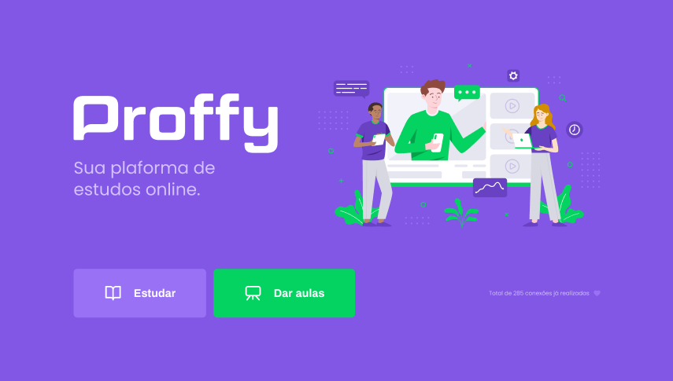

<p align="center">

</p>
<p align="center">Project developed during Rocketseat Next Level Weel #02 </p>

# :art: Layouts
## Web
<div>


</div>

## Mobile
<div>


</div>


# :computer: Technologies

- Typescript
- React
- React Native
- Expo
- Express

# :video_game: Run

```bash
    # Clone repository
    $ git clone https://github.com/kitkoshino/nlw-02.git
```

## Run API
-  Server folder

```bash
    #Instalar dependências:
    $ npm install

    # Rodar Aplicação:
    $ npm start
```

## Run API
-  Web folder

```bash
    #Install dependencies
    $ npm install
    
    # Run application
    $ npm start
```